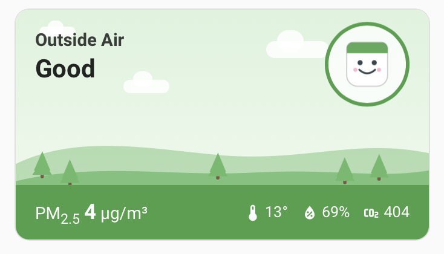
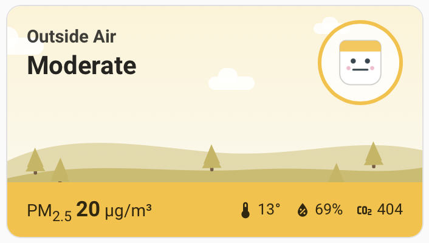
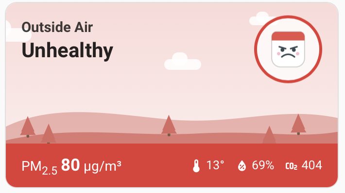
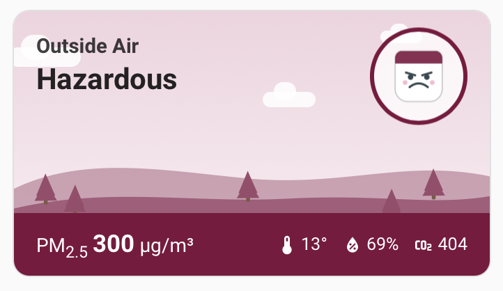

# AirGradient Public Location for Home Assistant

Follow any **public air-quality sensor from the [AirGradient map](https://www.airgradient.com/map)**
in Home Assistant — no AirGradient account and no API token required — and show it on your
dashboard with an animated, AirGradient-map-style card.

<p align="center">
  
</p>

The card's whole scene — sky, hills, and the mascot's mood — shifts with the US EPA PM2.5
category, so a glance tells you the air quality before you read a number.

| | | |
|---|---|---|
|  |  |  |
| **Good** | **Moderate** | **Unhealthy for Sensitive Groups** |
|  |  |  |
| **Unhealthy** | **Very Unhealthy** | **Hazardous** |

---

## What this is

The **official [AirGradient integration](https://www.home-assistant.io/integrations/airgradient/)**
only talks to a monitor you own, over your local network (you give it the device's IP). It
cannot pull data from other people's public sensors on the map.

This project does the opposite: it reads the **token-free public API** so you can follow a
sensor that belongs to someone else — for example the one two streets away — without owning
any hardware. The two integrations happily run side by side.

One HACS install gives you **both** halves:

### 1. Integration (`airgradient_public`)
Polls the AirGradient public API for one location and creates sensors:

- **PM2.5**, **PM10**, **PM1** (µg/m³)
- **Air quality index** — US AQI, computed from the EPA May-2024 PM2.5 breakpoints, with a
  `category` attribute (`good` … `hazardous`)
- **CO₂** (ppm), **Temperature** (°C), **Humidity** (%)
- **TVOC index**, **NOx index**
- **PM0.3 count** and **Wi-Fi signal** (disabled by default, as diagnostics)

All measurements enable long-term statistics, so Home Assistant records history for the
charts (see below) and for use anywhere else in HA.

### 2. Lovelace card (`custom:airgradient-map-card`)
Bundled with the integration and auto-registered — **no separate dashboard resource to add.**

- **Compact view** (shown above): an animated scene — drifting clouds, a bobbing mascot
  whose face and colour follow the air-quality category — with the current PM2.5 reading and
  temperature / humidity / CO₂ chips.
- **Tap to expand** into a detail sheet with:
  - a **24-hour PM2.5 chart** (colour-coded by category),
  - **last 12 h** and **last 24 h** averages,
  - a **WHO annual-guideline** comparison (how many × the 5 µg/m³ guideline),
  - a **cigarettes-equivalent** figure, and
  - a **10-days-by-hour heatmap**.

---

## Installation

### HACS (recommended)

1. In HACS, open the three-dot menu → **Custom repositories**.
2. Add `https://github.com/keranm/airgradient-public` with category **Integration**.
3. Find **AirGradient Public Location** in HACS, click **Download**.
4. **Restart Home Assistant** (Settings → System → ⋮ → Restart). HACS only downloads the
   files; Home Assistant loads the new integration on restart.

### Manual

Copy `custom_components/airgradient_public` into your `config/custom_components/` folder and
restart Home Assistant.

---

## Setup

### Add the integration

1. **Settings → Devices & Services → Add Integration → “AirGradient Public Location”.**
2. Enter the **location ID** of the public sensor you want to follow, then submit. The
   integration validates it against the API and names the device automatically.

**Finding a location ID:** open the sensor on the [AirGradient map](https://www.airgradient.com/map),
then confirm the ID via the API:

```
https://api.airgradient.com/public/api/v1/world/locations/<ID>/measures/current
```

To search by name, fetch every public sensor and look for yours:

```
https://api.airgradient.com/public/api/v1/world/locations/measures/current
```

> ⚠️ The `loc=` number in the map page URL is **not** the location ID. Use the `locationId`
> field returned by the API.

### Add the card

After the integration is set up, the card is available in the dashboard card picker as
**“AirGradient Map Card”** (search “AirGradient”). Or add it by YAML:

```yaml
type: custom:airgradient-map-card
entity: sensor.<your_location>_pm2_5
```

The card auto-discovers the temperature, humidity, and CO₂ sensors from the **same device**,
so `entity` (the PM2.5 sensor) is the only required option.

> 💡 **After installing or updating the card**, hard-refresh your browser once
> (**Cmd/Ctrl + Shift + R**) so it loads the new JavaScript. This is normal for any HACS
> frontend card.

#### Card options

| Option | Required | Description |
|---|---|---|
| `entity` | ✅ | The PM2.5 sensor to display. |
| `name` | – | Override the title (defaults to the device name). |
| `temperature` | – | Explicit temperature entity (otherwise auto-detected). |
| `humidity` | – | Explicit humidity entity (otherwise auto-detected). |
| `co2` | – | Explicit CO₂ entity (otherwise auto-detected). |

---

## How the history charts work

The AirGradient public API only serves the **current** reading for sensors you don't own, so
the card builds its charts from **Home Assistant's own recorder statistics**. This means the
charts **start empty and fill in over time**:

- the **24-hour chart** after a few hours,
- the **10-day heatmap** and the **30-day WHO / cigarette** figures over the following days.

The compact card, of course, is live immediately.

*(If you also own an AirGradient sensor, an account token could unlock server-side history —
a possible future enhancement.)*

---

## Try the different states

To preview how the card looks in each category without waiting for the air to actually get
worse, use **Developer Tools → States**: pick your PM2.5 entity, set its **State** to one of
the values below, and click **Set state**. The card recolours instantly. (The integration
re-polls every few minutes and will restore the real value.)

| Set state to | Category |
|---|---|
| `2` | Good |
| `20` | Moderate |
| `45` | Unhealthy for Sensitive Groups |
| `80` | Unhealthy |
| `200` | Very Unhealthy |
| `300` | Hazardous |

---

## Options

- **Update interval** (default 3 minutes): Settings → Devices & Services →
  AirGradient Public Location → **Configure**.

## Notes on methodology

- **AQI categories** use the [US EPA May-2024 PM2.5 breakpoints](https://www.airnow.gov/aqi/aqi-basics/).
- **WHO comparison** uses the 2021 annual PM2.5 guideline of **5 µg/m³**.
- **Cigarette equivalent** uses the [Berkeley Earth](https://berkeleyearth.org/air-pollution-and-cigarette-equivalence/)
  rule of thumb: a day breathing **22 µg/m³** of PM2.5 ≈ one cigarette.

## Attribution

Air quality data is provided by [AirGradient](https://www.airgradient.com/) under
[CC BY-SA 4.0](https://creativecommons.org/licenses/by-sa/4.0/). This project is not
affiliated with or endorsed by AirGradient; the card artwork is original.
